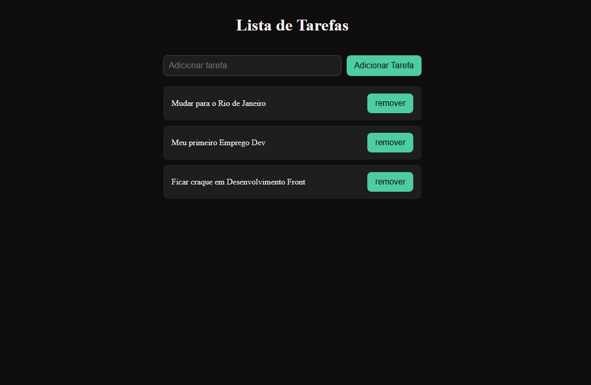
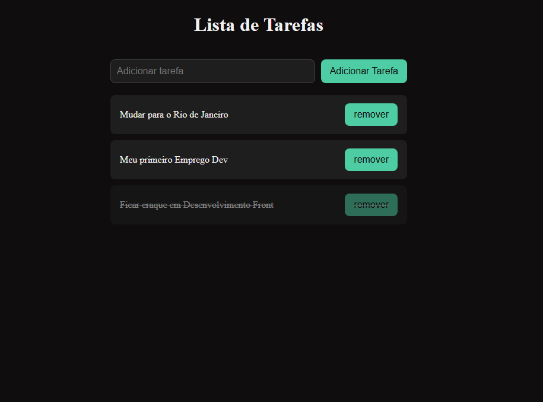

# ✅ To-Do List

Lista de tarefas funcional com persistência de dados no navegador.

---

## 📸 Screenshots

| Lista de Tarefas | Tarefa Concluída |
|------------------|------------------|
|  |  |

---

## 🚀 Funcionalidades

- Adicionar novas tarefas
- Marcar tarefa como concluída ao clicar (texto riscado)
- Remover tarefas individualmente
- Lista salva no navegador via localStorage
- Tarefas e estados persistem ao recarregar a página

---

## 🛠️ Tecnologias utilizadas

- HTML5
- CSS3 (Flexbox)
- JavaScript (ES6+)

---

## 💡 Conceitos praticados

- Criação dinâmica de elementos com `createElement` e `appendChild`
- Manipulação do DOM com `addEventListener`
- `classList.toggle` e `classList.add` para alternar estados
- `localStorage` com `JSON.stringify` e `JSON.parse`
- Arrays com `push`, `indexOf` e `splice`
- Funções reutilizáveis — princípio DRY
- Separação entre dados (array) e visual (DOM)

---

## 📦 Como executar

1. Clone o repositório:
```bash
git clone https://github.com/Dougiiee/toDoListNova
```

2. Acesse a pasta do projeto:
```bash
cd NOME-DO-REPO
```

3. Abra o arquivo `index.html` no navegador.

> Não é necessário instalar nenhuma dependência.

---

## 👨‍💻 Autor

Feito por **Douglas Laureano** — [LinkedIn](https://www.linkedin.com/in/douglas-laureano-dg/) · [GitHub](https://github.com/Dougiiee)
